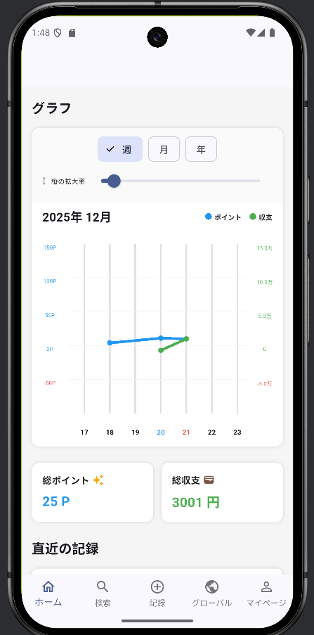
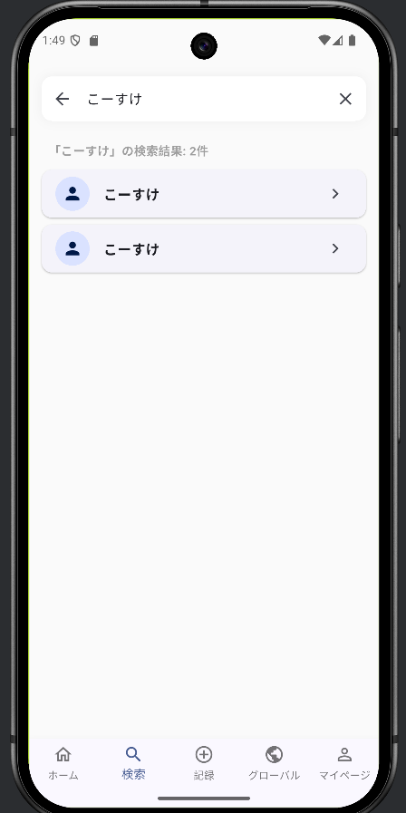
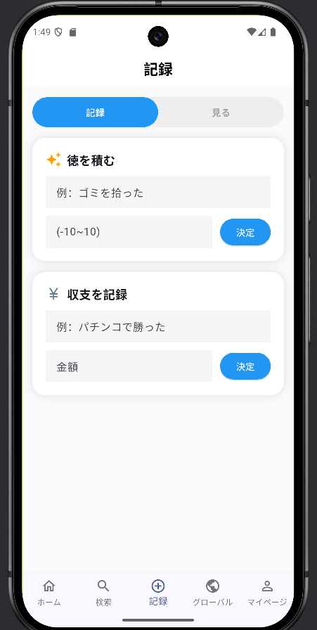
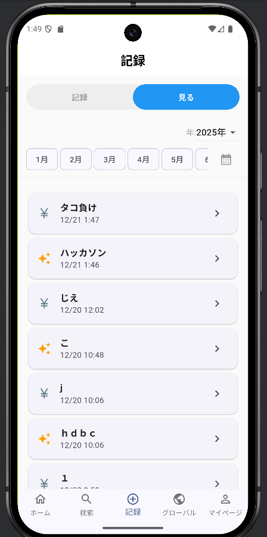
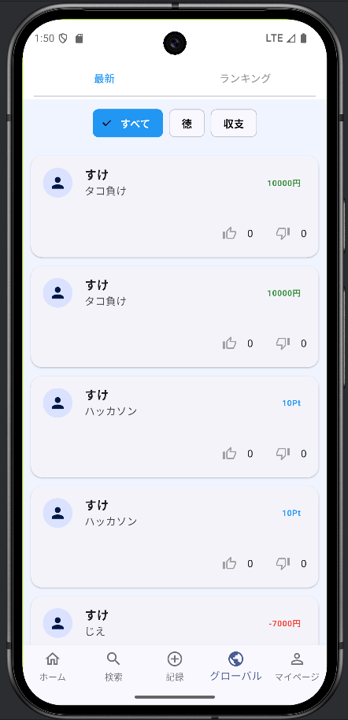
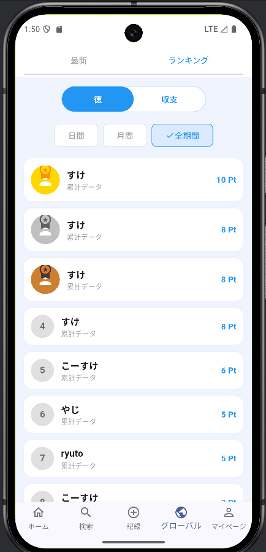
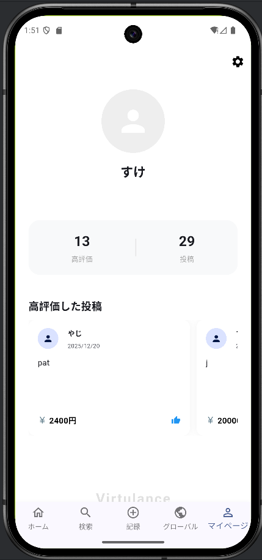

# P2HACKS2025 アピールシート

## プロダクト名
Virtulance(ヴァーチュランス)

「徳(Virtue)」と「天秤(balance)」を組み合わせた造語です。

## コンセプト
「徳を積む行動」と「収支」を同じ仕組みで記録・可視化・共有できるSNSアプリです。
日常の善行は記録に残らず忘れられがちですが、家計簿のように記録する習慣と同じ土俵に乗せることで、「徳」という抽象的な価値を扱いやすくしています。

## きっかけ
ハッカソンのテーマ「キラキラ」から連想したのは、まず「お金」、そして「ギャンブル」でした。自分たちのギャンブルの収支を記録し、他の人とも共有できるアプリを作ろう、というアイデアが企画の出発点になっています。

## 利用の流れ
1. アプリを開くと匿名認証で自動的にログインされる(会員登録は不要)
2. 初回は名前などを設定するウェルカム画面が表示される
3. 「記録」タブから「徳を積む」(-10〜10のポイント)または「収支」(金額)を記録する
4. 保存時に「自分のみ記録」か「世界に投稿」かを選べる
5. 「グラフ」タブで自分の徳・収支の推移を折れ線グラフで確認できる
6. 「グローバル」タブで、公開された他ユーザーの投稿を閲覧し、いいね/低評価で評価できる
7. 同じ「グローバル」タブのランキングで、徳・収支のポイントが高いユーザーを確認できる
8. 「検索」タブから他のユーザーを表示名で検索できる

## 推しポイント
- 「徳」という数値化しにくい価値を、収支と同じ仕組みの上で記録・可視化できるようにした発想
- 記録は常に端末内に保存され、「世界に投稿」を選んだものだけがFirestoreを通じて他ユーザーと共有される、ローカル優先の設計
- 匿名認証を採用し、会員登録なしですぐに使い始められる

## スクリーンショット

| グラフ画面 | ユーザー検索画面 | 記録画面 |
|---|---|---|
|  |  |  |

| 記録一覧画面 | 最新投稿画面 | ランキング画面 |
|---|---|---|
|  |  |  |

| マイページ画面 |
|---|
|  |

## 開発体制

### 役割分担

| メンバー | 役割 |
|---|---|
| すけすけ | リーダー / バックエンド(main.dart, firebase_service.dart) |
| Hayato | フロントエンド(search_page.dart, record_page.dart, global_page.dart, settings_page.dart) |
| こしおじ | iOS / デザイン |
| 西園寺こうぼう | フロントエンド(my_page_screen.dart) |
| しゅんたろう | マイページ画面(初期担当、途中からHayatoへ引き継ぎ) |

チーム名は「朝帰り」で、ハッカソン期間中にメンバーが朝帰りした回数(5回)が由来です。

### 開発における工夫した点
- チームメンバー全員がまともなアプリ開発が初めてだったため、実装に入る前にアプリ開発・環境構築についてチーム内で一緒に学習し、知識レベルのすり合わせを行った
- 役割分担後に画面間でUIのテイストがバラバラになった際は、自分の担当外の画面も含めてCursor AIを活用しUIを統一した
- 実機で動作確認したところUIの使いにくさに気づき、X(旧Twitter)やInstagramなど既存のSNSアプリを参考に改良した

## 開発技術

### 利用したプログラミング言語
- Dart

### 利用したフレームワーク・ライブラリ
- Flutter(Android / iOS対応)
- Firebase(Authentication / Cloud Firestore / Storage)
- fl_chart(グラフ描画)
- shared_preferences(ローカルデータ保存)
- image_picker / path_provider(プロフィール画像)

### その他開発に使用したツール・サービス
- GitHub(コード管理)
- Discord(チーム内のコード・資料共有、コミュニケーション)
- Android Studio / Xcode(実機・シミュレータでの動作確認)
- Cursor AI(コード生成、UIの統一、エラー原因調査、Firebase連携部分の実装補助などに活用)

---

## セットアップ手順

このリポジトリには、Firebaseの設定ファイル(`google-services.json` / `GoogleService-Info.plist`)は
セキュリティ上の理由から含まれていません。動かす場合は各自のFirebaseプロジェクトを作成し、
設定ファイルを配置してください。

```bash
# 1. パッケージを取得
flutter pub get

# 2. Firebase設定ファイルを配置
#    android/app/google-services.json
#    ios/Runner/GoogleService-Info.plist

# 3. 実行(実機 or エミュレータ/シミュレータを起動した状態で)
flutter run
```

> **Note:** `pubspec.yaml`は当時実際に使っていたファイルが見つかったため、それをベースにしています。
> ただし元のファイルには`firebase_core` / `firebase_auth` / `cloud_firestore` / `firebase_storage`の記載がなく、
> コードは実際にこれらをimportして使用しているため、この4パッケージのみバージョンを推測して追記しています。
> `flutter pub get`実行時にバージョン解決エラーが出た場合は適宜調整してください。

## 開発の背景について

このリポジトリは、ハッカソン当時Discordで共有されていたコードを、
就職活動用ポートフォリオ整備の一環として後からGitHubに整理・追加したものです。
`android/` `ios/` フォルダなどプロジェクト全体の再現はできていないため、`lib/`配下のDartコードのみを含みます。
開発の詳しい経緯・工夫点・技術選定の理由などは、ポートフォリオサイトに詳しくまとめています。
